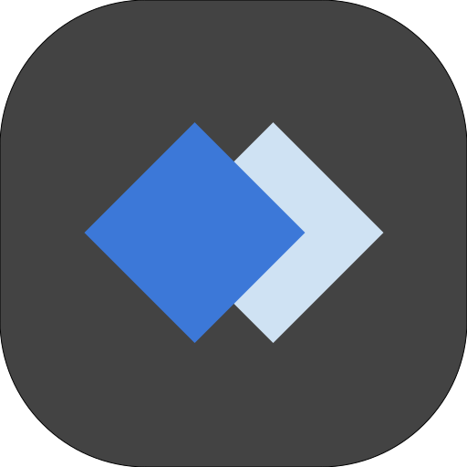

<a href="#">
  

    
  

  

    
  

</a>

  
  
  

  <!--  -->
  

  <strong>A modern auction platform for trading items.</strong>

<h3 align="center">
  <a href="CONTRIBUTING.md">Contribute</a>
   · 
  <a href="#">Production</a>
</h3>

---

## About Instant Auction

Instant Auction is a modern online platform for trading things you don't need anymore and receive something you might turn out to want that would otherwise be discarded.
_TODO: write more about our objective and motivation_

## Technologies used

### Language:

### Web Client

### Backend

### Infrastructure

## Contributing

We are open to any issues, pull requests, and comments on how we can make the project better.

## [Code of Conduct](/CODE_OF_CONDUCT.md)

## Branches

- staging -> open to pull requests

## License

Instant Auction is [GPLv3 Licensed](LICENSE)
